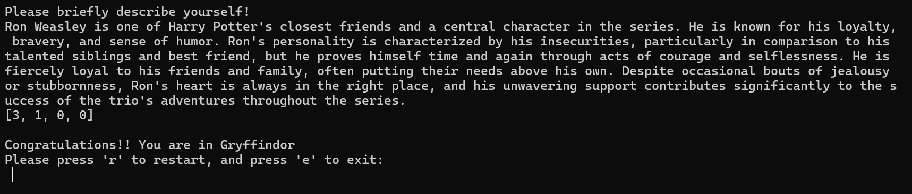
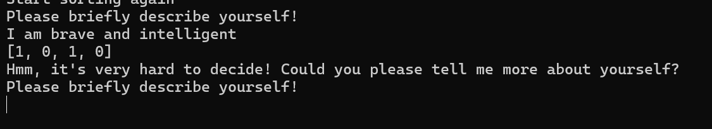
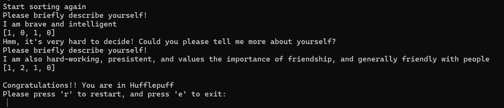

# The Hogwarts Sorting Hat 🎩

###### This mini-app will ask you to say something about yourself. Based on your description, the app will evaluate which Hogwarts house you belong to!
Creator: Yixing Wang

## How does it work?
This mini-app evaluates based on the **Term Frequency (tf) score** from the user's input:

- Each house (Gryffindor🦁, Huffelpuff🦝, Ravenclaw🐦‍⬛, Slytherin🐍) is given 15 keywords of characteristics that a student of this house shall possess;
- Ask the user to tell about him/herself
- Turn keywords of each house and user input to lower-case and take their word stems;
- Calculate the Term Frequency (tf) score of each house: if a stemmed word from the user input matches a stem word of a house's keyword list, add one to the tf-score of that house.
- House with the highest tf-score is selected! 🔮

For example: _brave_ is a keyword of house _Gryffindor_. If a user says _'I am brave'_, we add 1 to Gryffindor's tf-score.  
For the sake of time, the keywords of each house were generated by _chatGPT_. 

### Sources that I used:
- chatGPT: To generate keywords for each house
- Documentation of NLTK

### Screenshot Demo:
We tell the app something about _Ron Weasley_, and it says that he belongs to _Gryffindor_:

Now I will say something about myself.  
App asks me to say something more because the information I provided was too little to make a decision - _Gryffindor_ and _Ravenclaw_ have the same tf-score because _brave_ is a keyword for _Gryffindor_ and _intelligent_ is a keyword for _Ravenclaw_:

After adding a few sentences, the App summed up the tf-score of the old and the new input. Now it says I am in _Huffelpuff_!

## Why?
- tf-score is easy and simple to implement;
- tf-score is relatively reliable in this case. The more a person highlights that he/she is brave, the higher change this person might be assigned to Gryffindor!
- stemming simplifies the complexity of word types: **no need to worry about if a word is adj. noun, or verb,** sentences such as _"I am knowledgable"_ and _"I am thirsty for knowledge"_ will be treated as having the same context!

## Ideas for the future:
- Implement negation and opposition detection: if someone says _"I am not brave"_, _"I am timid"_, then substract 1 point from Gryffindor;
- Evaluate app performance with labeled data
- Try advanced model. Naive Baysian Classifier would be my personal favorite 😉
- Once we have a labelled dataset with lots of description: calculate tf-idf score of each houses to see if this helps with model performance!
